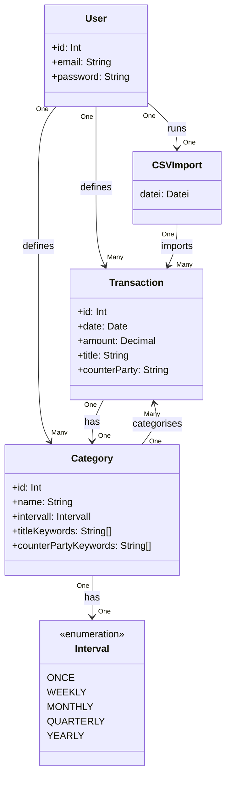

# Finance App Backend Spec

## 1. Ziele

Der Benutzter kommuniziert mit einer REST-API und kann:
* Einen Account / User erstellen, mit Password + Email
* Transaktionen erstellen, bearbeiten, löschen
* Transaktionen automatisch kategorisieren
* Kategorien erstellen, bearbeiten, löschen
* Standart Kategorie ist "Anderes", und wird dem User nicht zum bearbeiten bzw löschen angezeigt 
* Transaktionen kategoriesieren, indem nach Sender/Empfänger- bzw Titel-Schlüsselwörter gesucht werden
* Finanzübersichten einsehen
* Transaktionen durchsuchen & nach Kategorie filtern 
* Banktransaktionen als CSV importieren
* Zukünftige Ausgaben prognositzieren, indem
  * Kategorien als Wiederholend (Interval: Wöchentlich, Monatlich, Vierteljährlich, Jährlich) markiert werden können
  * Durchschnitt von den restlichen kosten der Kategorien (Interval: Einmalig)

Die RESTful-API wird mit ASP.NET Core implementiert und nutzt den Microsoft SQL-Server als Datenbank.

## 2. Domänenmodell



### 2.1 User
Eigenschaften:
* Email
* Password
* Transaktionen
* Kategorien
* Kann Transaktionen als CSV importieren

### 2.2 Transaction
Eine Transaction repräsentiert eine Zahlung bzw. Einnahme.
Eigenschaften:
* Datum (ohne Uhrzeit)
* Amount
* Sender (Recipient)
* Title
* Kategorie

### 2.3 Category
Eine Category dient zur Gruppierung von Transaktionen.
Eigenschaften:
* Name: z.B. Essen
* TitleKeywords: z.B. Rewe, Edeka
* SenderKeywords: z.B. "Mama" für Unterhalt
* Interval: "Once" / "Weekly" / "Monthly" / "Yearly"

## 3. Geschäftsregeln

* **Ownership**: Ein User darf nur seine eigenen Daten einsehen & modifizieren
* **Kategorien & Transaktionen**: Eine Transaktion muss genau(!) eine Kategorie haben (standardmäßig "Anderes")
* **Kategorie Regeln**: Das Automatische kategoriesieren erfolg über das setzten von Title- bzw Recipient- Schlüsselwörter. Bei mehreren Treffern gibt es folgende Wertungen
    * Zu wieviel % entspricht der Titel (/Empfänger) dem Schlüsselwort?
    * Mehrere Treffer der selben Kategorie schlagen weniger Treffer einer anderen.
    * Bei Gleichstand: Fehler wird zurückgegeben, kategorie ist 'anderes'
* **Password**: Wird als Hash Gespeichert (+ Salt)
* **Beträge**: Positiv = Einnahme, Negativ = Ausgabe
* **CSV-Import**: Stimmen bereits existierende Transaktionen mit Transaktionen aus dem CSV-Import überein, werden diese nicht dupliziert.

## 4. Datenbankdesign

### 4.1 Users

| Id (pk) | Email | PasswordHash | 
| ----------- | ----------- | ----------- |
| 1 | example.mail@gmx.de | 5e9a987v.. |

### 4.2 Transaction

| Id (pk) | UserId (fk) | Date | Amount | Recipient | Title | CategoryId (fk) |
| ----------- | ----------- | ----------- | ----------- | ----------- | ----------- | --------- |
| 1 | 1 | 24.01.2006 | -53.67 | Finanzamt | Schulden für keineahnung | 5 |

### 4.3 Category

| Id (pk) | UserId (fk) | Name | TitleKeywords | RecipientKeywords | Interval |
| ----------- | ----------- | ----------- | ----------- | ---------- | ---------- |
| 1 | 1 | Essen | [Rewe Kartenzahlung,..] | [Rewe,..] | Once |

## 5. DTOs

### 5.1 User

| UserCreate | UserUpdate | UserResponse |
| ----------- | ----------- | ----------- |
| Email | Email | Id |
| Password | Password | Email |

### 5.2 Transaction

| TransactionCreate | TransactionUpdate | TransactionResponse |
| ----------- | ----------- | ----------- |
| Date | Date | Id |
| Amount | Amount | Date |
| Recipient | Recipient | Amount |
| Title | Title | Recipient |
|  |  | Title |

### 5.3 Category

| CategoryCreate | CategoryUpdate | CategoryResponse |
| ----------- | ----------- | ----------- |
| Name | Name | Id |
| Keywords | Keywords | Name |
| Interval | Interval | Keywords |
|  |  | Interval |

## 6. API-Endpunkte

**User**
```
GET /api/users        --> UserResponse[]
GET /api/users/{id}   --> UserResponse
POST /api/users       <-- UserCreate
PUT /api/users/{id}   <-- UserUpdate
DELETE /api/users/{id}
```

**Transaction**
```
GET /api/users/{userId}/transactions  --> TransactionResponse[]
GET /api/transactions/{id}            --> TransactionResponse
POST /api/users/{userId}/transactions <-- TransactionCreate
PUT /api/transactions/{id}            <-- TransactionUpdate
DELETE /api/transactions/{id}
```

**Category**
```
GET /api/users/{userId}/categories  --> CategoryResponse[]
GET /api/categories/{id}            --> CategoryResponse
POST /api/users/{userId}/categories <-- CategoryCreate
PUT /api/categories/{id}            <-- CategoryUpdate
DELETE /api/categories/{id}
```

**CSV-Import**
```
TODO
```

## 7. Offene Entscheidungen
* CSV-Format ? 
* Title mit KI Kurzfassen
