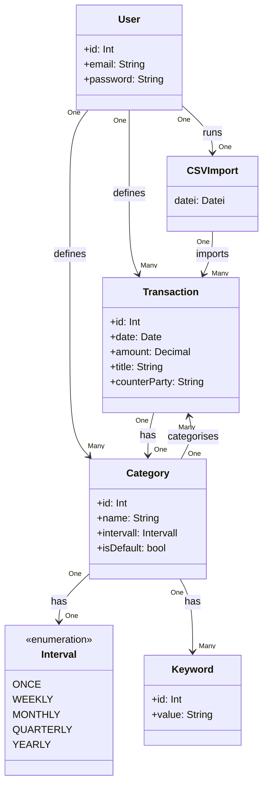

# Finance App Backend Spec

## 1. Ziele

Der Benutzter kommuniziert mit einer REST-API und kann:
* Einen Account / User erstellen, mit Password + Email
* Transaktionen erstellen, bearbeiten, löschen
* Transaktionen automatisch kategorisieren
* Kategorien erstellen, bearbeiten, löschen
* Standart Kategorie ist "Anderes", und wird dem User nicht zum bearbeiten bzw löschen angezeigt 
* Transaktionen kategoriesieren, indem nach Sender/Empfänger- und Titel-Schlüsselwörter gesucht werden
* Finanzübersichten einsehen
* Transaktionen durchsuchen & nach Kategorie filtern 
* Banktransaktionen als CSV importieren
* Zukünftige Ausgaben prognositzieren, indem
  * Kategorien als Wiederholend (Interval: Wöchentlich, Monatlich, Vierteljährlich, Jährlich) markiert werden können
  * Durchschnitt von den restlichen kosten der Kategorien (Interval: Einmalig)

Die RESTful-API wird mit ASP.NET Core implementiert und nutzt den Microsoft SQL-Server als Datenbank.

## 2. Domänenmodell



## 3. Geschäftsregeln

* **Ownership**: Ein User darf nur seine eigenen Daten einsehen & modifizieren
* **Kategorien & Transaktionen**: Eine Transaktion muss genau(!) eine Kategorie haben (standardmäßig "Anderes")
* **Keywords**: Ein Keyword kann in einer Kategorie nur 1x vorkommen.
* **Kategorie Regeln**: Das Automatische kategoriesieren erfolg über das setzten von Title- bzw CounterParty- Schlüsselwörter. Bei mehreren Treffern gibt es folgende Lösung:
    * Ein Fenster erscheint, der User entscheidet welche Kategorie angenommen wird.
* **Beträge**: Positiv = Einnahme, Negativ = Ausgabe
* **CSV-Import**: Stimmen bereits existierende Transaktionen mit Transaktionen aus dem CSV-Import überein, werden diese nicht dupliziert.

## 4. Datenbankdesign

### 4.1 Users

| Id (pk) | Email | Password | 
| ----------- | ----------- | ----------- |
| 1 | example.mail@gmx.de | myPassword123! |

### 4.2 Transaction

| Id (pk) | Date | Amount | CounterParty | Title | UserId (fk) | CategoryId (fk) |
| ----------- | ----------- | ----------- | ----------- | ----------- | ----------- | --------- |
| 1 | 24.01.2006 | -53.67 | Finanzamt | Schulden für keineahnung | 1 | 5 |

### 4.3 Category

| Id (pk) | Name | Interval | isDefault (bit) | UserId (fk) |
| ----------- | ----------- | ----------- | ----------- | ----------- |
| 1 | Essen | Once | 0 | 1 |

### 4.4 Keyword

| Id (pk) | Value | CategoryId (fk) |
| ----------- | ----------- | ----------- |
| 2 | Rewe | 1 |

## 5. DTOs

### 5.1 User

**RegisterRequestDto**
* Email (required, email)
* Password (required, mind. 8 Zeichen)
* ConfirmPassword (required, mind. 8 Zeichen)

**LoginRequestDto**
* Email (required, email)
* Password (required)

**UserResponseDto**
* Id
* Email

**UserUpdateDto**
* Email (optional, email)

**ChangePasswordDto**
* CurrentPassword (required)
* NewPassword (required)
* ConfirmNewPassword (required)

### 5.2 Transaction

**TransactionResponseDto**
* Id
* Date
* Amount
* CounterParty
* Title
* CategoryId
* CategoryName

**TransactionCreateDto**
* Date      (required, DateOnly)
* Amount    (required, decimal(12,2))
* CounterParty  (optional, maxLength(255))
* Title     (optional, maxLength(500))
* CategoryId    (optional)

**TransactionUpdateDto**
* Date  (optional)
* Amount    (optional)
* CounterParty  (optional)
* Title     (optional)
* CategoryId    (optional)
* detectCategory    (bool, optional)    <---?? nicht sicher, seperater api call?

**TransactionImportResposneDto**
* ImportedRows
* Errors

### 5.3 Category

**CategoryResponseDto**
* Id
* Name
* Interval  (string)
* Keywords  (KeywordResponseDto[])
* isDefault (bool)

**CategoryCreateDto**
* Name      (required, maxLength(255))
* Interval  (optional, default: Once)
* Keywords  (optional, KeywordCreateDto[])

**CategoryUpdateDto**
* Name      (optional)
* Interval  (optional)

### 5.4 Keyword

**KeywordResponseDto**
* Id
* Value
* CategoryId

**KeywordCreateDto**
* Value

**KeywordUpdateDto**
* Value (optional)

### 5.5 Other

**SummaryResponseDto**
* LoadedTransactions
* Income
* Expenses
* CategorySummaryDto[]
* ??????...

**CategorySummaryDto**
* Name
* Amount
* ??????...

**ForecastResponseDto**
* Balance
* ??????...

## 6. API-Endpunkte

```
POST /api/auth/register
POST /api/auth/login
```

```
GET /api/users          (als Admin)
GET /api/users/me
PUT /api/users/me
DELETE /api/users/me
DELETE /api/users/{id}  (als Admin)
```

```
GET /api/transactions
GET /api/transactions/{id}
POST /api/transactions
PUT /api/transactions/{id}
DELETE /api/transactions
DELETE /api/transactions/{id}

POST /api/transactions/import
```

```
GET /api/categories
GET /api/categories/{id}
POST /api/categories
PUT /api/categories/{id}
DELETE /api/categories
DELETE /api/categories/{id}
```

```
POST /api/categories/{categoryId}/keywords
PUT /api/categories/{categoryId}/keywords/{keywordId}
DELETE /api/categories/{categoryId}/keywords
DELETE /api/categories/{categoryId}/keywords/{keywordId}
```

```
GET /api/analytics/summary/{days}
GET /api/analytics/forecast/{days}
```

## 7. Offene Entscheidungen
* Mehrere CSV formate?
* Title mit KI Kurzfassen
