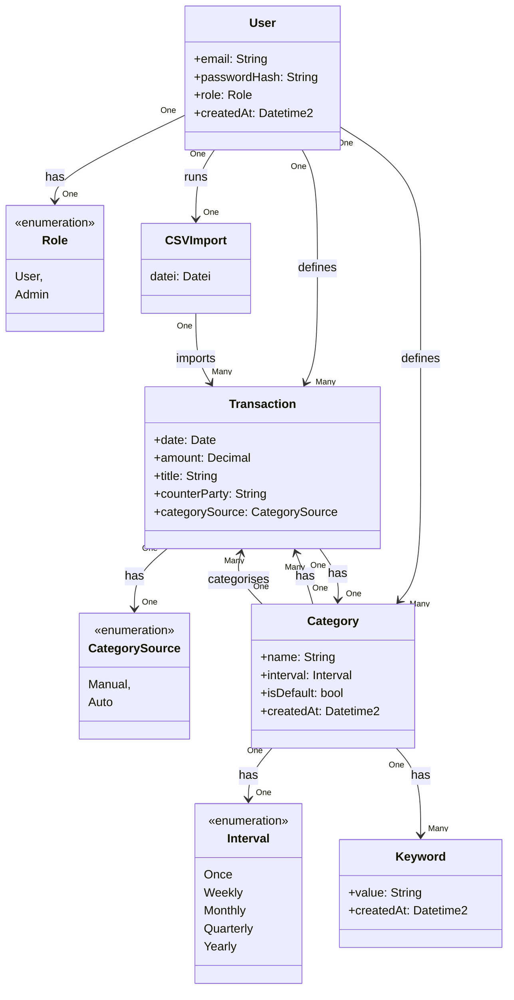

# Domain-Model

```mermaid
classDiagram
    class User {
        +email: String
        +passwordHash: String
        +role: Role
        +createdAt: Datetime2
    }

    class Role {
        <<enumeration>>
        User,
        Admin
    }

    class Transaction {
        +date: Date
        +amount: Decimal
        +title: String
        +counterParty: String
        +categorySource: CategorySource
    }

    class CategorySource {
        <<enumeration>>
        Manual,
        Auto
    }

    class Category {
        +name: String
        +interval: Interval
        +isDefault: bool
        +createdAt: Datetime2
    }

    class Interval {
        <<enumeration>>
        Once
        Weekly
        Monthly
        Quarterly
        Yearly
    }

    class Keyword {
        +value: String
        +createdAt: Datetime2
    }

    class CSVImport {
        datei: Datei
    }

    User "One" --> "One" Role : has
    User "One" --> "Many" Transaction : defines
    User "One" --> "Many" Category : defines

    Transaction "One" --> "One" CategorySource : has
    Transaction "One" --> "One" Category : has

    Category "One" --> "One" Interval : has
    Category "One" --> "Many" Transaction : has
    Category "One" --> "Many" Keyword : has
    Category "One" --> "Many" Transaction : categorises

    User "One" --> "One" CSVImport : runs
    CSVImport "One" --> "Many" Transaction : imports
```