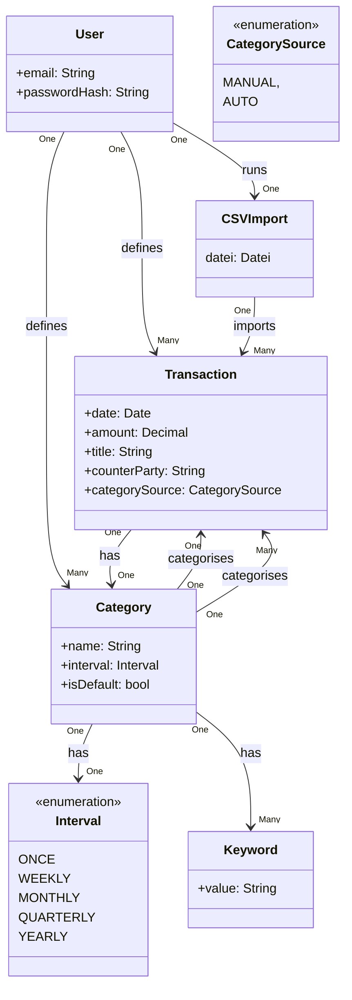

# Domain-Model

```mermaid
classDiagram
    class User {
        +email: String
        +passwordHash: String
    }

    class Transaction {
        +date: Date
        +amount: Decimal
        +title: String
        +counterParty: String
        +categorySource: CategorySource
    }

    class CategorySource {
        <<enumeration>>
        MANUAL,
        AUTO
    }

    class Category {
        +name: String
        +interval: Interval
        +isDefault: bool
    }

    class Interval {
        <<enumeration>>
        ONCE
        WEEKLY
        MONTHLY
        QUARTERLY
        YEARLY
    }

    class Keyword {
        +value: String
    }

    class CSVImport {
        datei: Datei
    }

    User "One" --> "Many" Transaction : defines
    User "One" --> "Many" Category : defines

    Category "One" --> "One" Interval : has
    Category "One" --> "One" Transaction : categorises
    Category "One" --> "Many" Transaction : categorises
    Category "One" --> "Many" Keyword : has

    Transaction "One" --> "One" Category : has
    User "One" --> "One" CSVImport : runs
    CSVImport "One" --> "Many" Transaction : imports
```