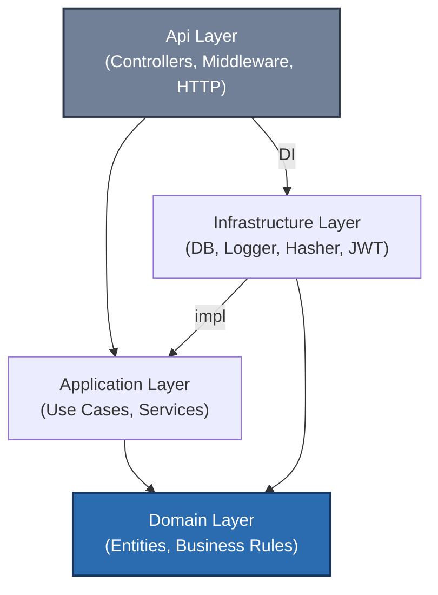
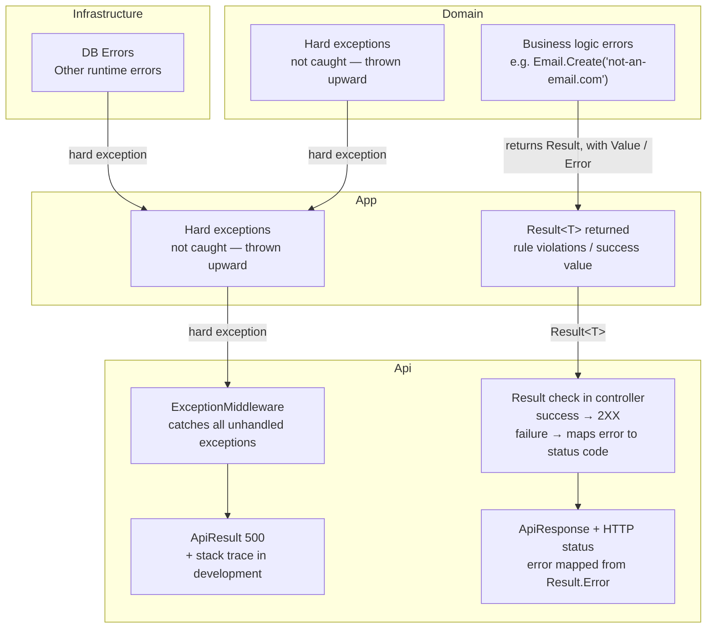

# Architecture
How our system is managed, organized, and how it interacts to keep the system maintainable, scalable and adaptable to change over time.

## 1. Overview
We have 4 distinct layers:
- [**Api:**](./Layers/Api.md) Boundary to the outside world, communicates with the frontend
- **Application:** All application logic and use cases
- [**Infrastructure:**](./Layers/Infrastructure.md) Technical implementations such as persistence (DB access), JWT tokens, hashing
- [**Domain:**](./Layers/Domain.md) The core of the software system. Defines all entities, enums and value objects, including their rules (e.g. an email must contain an @ symbol). Has no dependencies on other layers.

Each layer has its own .NET project, all bundled in a single solution. This also ensures that layers are genuinely self-contained. It strengthens precise testing and brings much more structure overall. Connections are created with `dotnet add Api reference Application`, but **only** the connections that are architecturally correct:



The Application Layer uses the Infrastructure Layer's implementation **indirectly**, through interfaces. This means the Application Layer is **NOT dependent** on the Infrastructure Layer. These interfaces represent the boundary between the two layers: method signatures are defined in Application and implemented by Infrastructure.
These implementations are then injected with DI (dependency-injection) by the Api layer.


## 2. Request flow
1. Client sends HTTP request
2. ASP.NET maps it to DTO & validates
    - If validation fails, don't execute controller code, send back "bad request", 400
3. Controller code executes, calls service & appropriate use case
4. Service executes business logic
    - On business errors, returns a `Result` with `Result.Error`
5. External dependencies (DB, etc.) are accessed via interfaces
6. Domain entities are modified
    * Business errors could occur -> returns a error result
7. Result is returned to controller
8. Controller maps result to HTTP response


## 3. Data validation & invariants
We imagine a request (or requests) coming to the Api with certain rule violations:
- Wrong Email format
* Password field missing
+ Deleting the default category

All formatting / basic validation errors are handled by the DTO validation, **before** the controller code is run. This includes e.g. Password field missing (and wrong email format too maybe).

All other rule violations, e.g. trying to delete the default category, are handled in the Domain layer, in our core. The resulting result is passed through the layers upwards, where it gets mapped to the corresponding HTTP error.

Sometimes, rules are enforced across the Api and Domain layer, or maybe even more. And that's okay, i guess.

(for our business rules see [Domain.md](./Layers/Domain.md) or the corresponding feature [Api.md](./Layers/Api.md))


## 4. Error propagation
So called "hard errors" are exceptions that are thrown, and not forwarded by some "Result" type. All other errors, caused by violating business rules, are forwarded by "Result" types.



**Result type** 
Basically the same on App & Domain layer (and even Api layer), but errors are still mapped before passed on to the layers above.
```cs
enum ErrorCode {
    UserNotFound,
    EmailAlreadyExists,
    InvalidPassword
    // ...
}

class Result<T> {
    public T? Value { get; }
    public ErrorCode? Error { get; }
    // ...
}
```
(Sketch does not necessarily correspond to the actual implementation)
