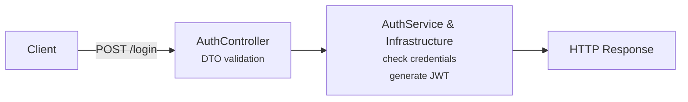

# Auth
`/api/auth` handles authentication, registering, logging in, etc. It is **not** responsible for handling users (e.g. delete, update -> [Users.md](./Users.md)) and it is **not** responsible for generating JWTs / hashes. 

- [Endpoints](#1-endpoints)
    - [Registrierung](#11-registrierung)
    - [Login](#12-login)
- [DTOs](#2-DTOs)
    - [RegisterRequestDTO](#21-registerrequestdto)
    - [LoginRequestDTO](#22-loginrequestdto)
    - [AuthResponseDTO](#23-authresponsedto)

## 1. Auth-Flow


## 1. Endpoints

### 1.1 Registrierung
**POST** `/api/auth/register`
Register a new user -> sets `createdAt`, creates default category.

**Request body:**
[RegisterRequestDTO](#21-registerrequestdto)

**Responses:**
- http 201, data: [AuthResponseDTO](#23-authresponsedto)
- http 400, status: VALIDATION_ERROR, bei ungültigen Eingaben
- http 409, status: ALREADY_EXISTS_ERROR, bei bereits registrierter Email

### 1.2 Login
**POST** `/api/auth/login`
Login as a existing user, generates a JWT.

**Request Body:**
[LoginRequestDTO](#22-loginrequestdto)

**Responses:**
- http 200, data: [AuthResponseDTO](#23-authresponsedto)
- http 400, status: VALIDATION_ERROR, bei ungültigen Eingaben
- http 401, status: UNAUTHORIZED_ERROR, bei falschen Credentials


## 2. DTOs

### 2.1 RegisterRequestDTO

**POST**[/api/auth/register](#11-registrierung)
```json
{
    "email": "user@example.com",
    "password": "password123",
    "confirmPassword": "password123"
}
```
**Validierung**
- `email`
    - required
    - Email-Format
    - Max. 255 Zeichen
- `password`
    - required
    - Min. 8 Zeichen
    - Max. 255 Zeichen
- `confirmPassword`
    - required
    - Equals `password`
    - Min. 8 Zeichen
    - Max. 255 Zeichen

### 2.2 LoginRequestDTO

**POST**[/api/auth/login](#12-login)
```json
{
    "email": "peterhans@gmx.de",
    "password": "password123"
}
```
**Validierung**
- `email`
    - required
    - Email-Format
    - Max. 255 Zeichen
- `password`
    - required
    - Min. 8 Zeichen
    - Max. 255 Zeichen

### 2.3 AuthResponseDTO

**POST**[/api/auth/register](#11-registrierung)

**POST**[/api/auth/login](#12-login)
```json
{
    "token": "123po1j23ß01j23ß91hj2301jh2"
}
```
