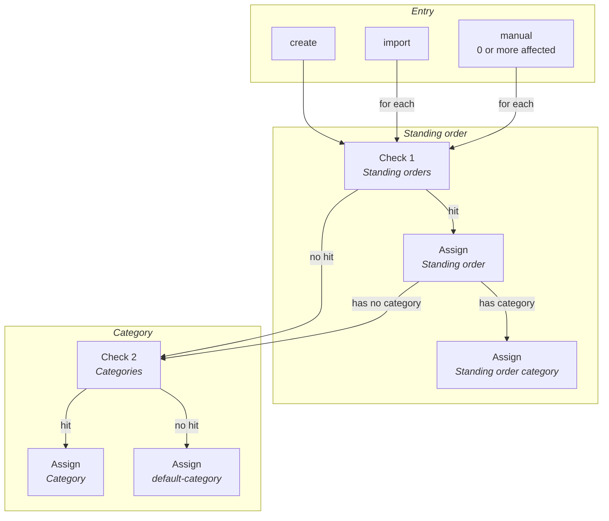

# Auto-Categorization
This feature includes automatically assigning standing orders & categories to transactions based on keywords.

## 1. Flow
The user calls an *auto-assign* action (by creating a transaction / importing / updating /  manually calling). Then, every transaction gets checked: first for any standing order machtes, then category matches. But only check for category matches, if the standing order has no assigned category.

As a graph:

## 2. Rating of hits
For each **check**, a hit list is created, sorted by descending relevance. Relevance is composed of:

- Number of keywords of a category that appear in the transaction
- Proportion of the keywords relative to the transaction title. E.g. for the keyword "Essen" and transaction title "Essen gehen", the proportion is 50%, since "Essen" makes up 5 of the 10 non-whitespace characters of the title.
- Only categories are returned that have at least one keyword appearing in the transaction.
- The default category is ALWAYS returned with the lowest relevance, even if it has no keywords or its keywords do not appear in the transaction.