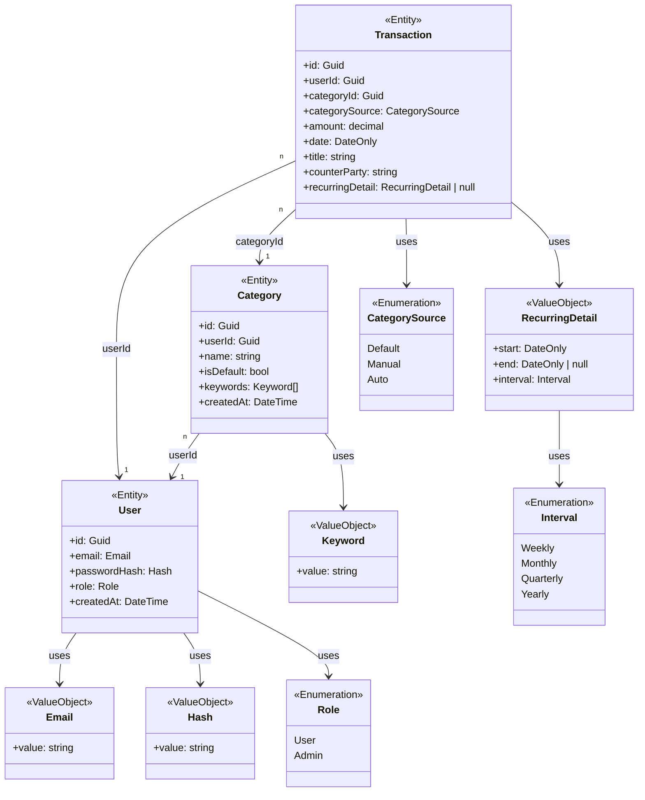

# Domain
To ensure the invariants and correctness of the system, all entities & value objects are created with a `.Create(..)` method. All properties are public for access, but not for modification. To modify all properties, use the corresponding methods, e.g. `User.ChangeEmail(Email email)` or `Category.SetDefault()`.

If invariants are violated, the method returns `DomainResult` with `DomainResult.Error != null`. Otherwise, returns a `DomainResult` with a specific `DomainResult.Value` of type `T`.

## 1. Rules
**User**
- Valid email (RFC 5322, ignore case, all set to lower), not whitespace
- PasswordHash not empty / whitespace

**Category**
- Name not empty / whitespace
- Cannot be deleted if its the default-category
- Keywords of the default-category cannot be added / removed
- Keywords within a category must be unique
- Keyword not empty / whitespace

**Transaction**
- Amount must not be zero
- A transactions category must belong to the same user as the transaction
- A transactions date must not be in the future
- Recurring detail:
    - start date <= end date
    - end date may be null (infinite recurring)

**Cross-Aggregate Rules**
- Unique email
- Deleting user deletes all related categories & transactions
- Category name must be unique per user
- User has exacly one default category
- When a category is deleted, the corresponding transactions are assigned to default-category
- On transaction creation, if no category is specified, the users default-category is assigned
- Default category cannot be set to not-default if its the only default category

Cross-Aggregate rules are **not** enforced on this domain-layer.

## 2. Aggregates
All entities are aggregate-roots, because loading all `Transaction`s & `Categorie`s when loading a `User` would be too inefficient if we just want the email for example.

## 3. Diagram

 