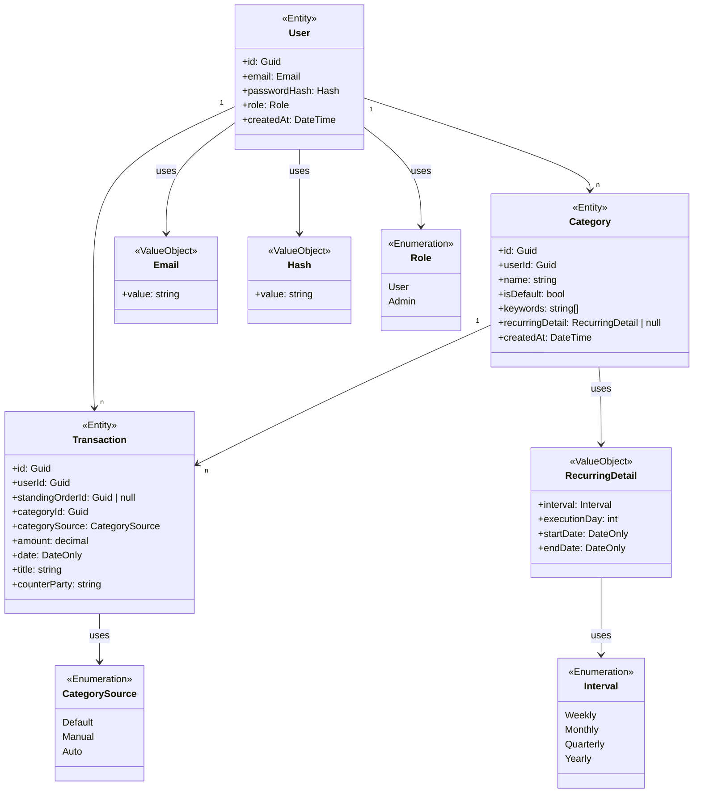

# Domain
To ensure the invariants and correctness of the system, all entities & value objects are created with a `.Create(..)` method. All properties are public for access, but not for modification. To modify all properties, use the corresponding methods, e.g. `User.ChangeEmail(Email email)` or `Category.SetDefault()`.

If invariants are violated, the method returns `DomainResult` with `DomainResult.Success == false`. Otherwise, returns a `DomainResult` with a specific `DomainResult.Value` of type `T`.

## 1. Rules
**User**
- Valid email (RFC 5322, ignore case, all set to lower), not whitespace
- PasswordHash not empty / whitespace

**Transaction**
- Amount must not be zero
- A transactions category must belong to the same user as the transaction
- A transactions date must not be in the future

**Category**
- `name` not empty / whitespace
- Cannot be deleted if its the default-category
- `keyword`'s of the default-category cannot be added / removed
- `keyword`'s within a category must be unique
- `keyword`'s not empty / whitespace
- `recurringDetail`:
	- If no `executionDay` is specified, `executionDay = 1`? not sure
	- If no `endDate` is specified, `endDate = DateOnly.MaxValue`
	- `startDate <= endDate`

**Cross-Aggregate Rules**
- Unique email
- Deleting user deletes all related categories & transactions
- Category name must be unique per user
- User has exactly one default category
- When a category is deleted, the corresponding transactions are assigned to default-category
- On transaction creation, if no category is specified, the users default-category is assigned
- Default category cannot be set to not-default if its the only default category
Cross-Aggregate rules are **not** enforced on this domain-layer.

## 2. Aggregates
All entities are aggregate-roots, because loading all `Transaction`s & `Categorie`s when loading a `User` would be too inefficient if we just want the email for example.

## 3. Diagram
Explanation below

```mermaid
classDiagram
    class User {
        <<Entity>>
        +id: Guid
        +email: Email
        +passwordHash: Hash
        +role: Role
        +createdAt: DateTime
    }

    class Transaction {
        <<Entity>>
        +id: Guid
        +userId: Guid
        +standingOrderId: Guid | null
        +categoryId: Guid
        +categorySource: CategorySource
        +amount: decimal
        +date: DateOnly
        +title: string
        +counterParty: string
    }

    class Category {
        <<Entity>>
        +id: Guid
        +userId: Guid
        +name: string
        +isDefault: bool
        +keywords: string[]
        +recurringDetail: RecurringDetail | null
        +createdAt: DateTime
    }


    class Email {
        <<ValueObject>>
        +value: string
    }

    class Hash {
        <<ValueObject>>
        +value: string
    }
	
	class RecurringDetail {
		<<ValueObject>>
		+interval: Interval
	    +executionDay: int
	    +startDate: DateOnly
	    +endDate: DateOnly
	}


    class Role {
        <<Enumeration>>
        User
        Admin
    }

    class CategorySource {
        <<Enumeration>>
        Default
        Manual
        Auto
    }

    class Interval {
        <<Enumeration>>
        Weekly
        Monthly
        Quarterly
        Yearly
    }


	User --> Email : uses
    User --> Hash : uses
    User --> Role : uses

	User "1" --> "n" Category
    Category "1" --> "n" Transaction
	Category --> RecurringDetail : uses
    RecurringDetail --> Interval : uses

	User "1" --> "n" Transaction
    
    Transaction --> CategorySource : uses
```

**User**
- We use `email` (or `id` for application logic) for identifying a user, no username
- Password is stored as a hash
- `createdAt` is used for analytics and to sort users logically when requesting a list of all users
- Owns: n `Transaction`'s, n `Categorie`'s and n `StandingOrder`'s
**Transaction**
- The core entity of our application
- Owned by **one** user
- `categorySource` is specified to give custom rules for certain actions (e.g. auto-categorize)
**Category**
- Used to (auto-) categorize `Transaction`'s and give a good overview on financial analytics to the user.
- Owned by **one** user
- References n `Transaction`'s
- Has keywords, used fyor auto-categorization.
- `recurringDetail` could be null -> category not recurring
-  `recurringDetail.executionDay` is depended on `interval`, if `interval = Weekly` and `executionDay = 2`, the standing order is expected to be executed on Tuesday.  