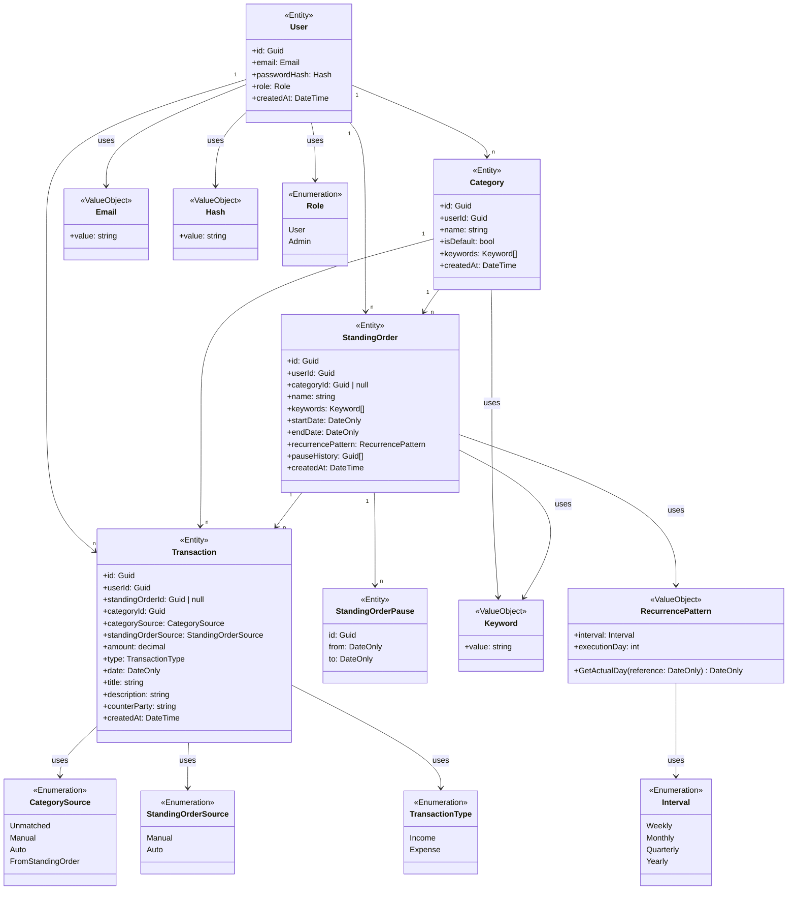

# Domain
To ensure the invariants and correctness of the system, all entities & value objects are created with a `.Create(..)` method. All properties are public for access, but not for modification. To modify all properties, use the corresponding methods, e.g. `User.ChangeEmail(Email email)` or `Category.SetDefault()`.

If invariants are violated, the method returns `DomainResult` with `DomainResult.Success == false`. Otherwise, returns a `DomainResult` with a specific `DomainResult.Value` of type `T`.

## 1. Rules
**User**
- Valid email (RFC 5322, ignore case, all set to lower), not whitespace
- PasswordHash not empty / whitespace

**Transaction**
- Amount must not be zero
- A transactions category must belong to the same user as the transaction
- A transactions date must not be in the future
- `title` not empty / whitespace
- `amount` always positive, not zero

**Category**
- `name` not empty / whitespace
- Cannot be deleted if its the default-category
- `keyword`'s of the default-category cannot be added / removed
- `keyword`'s within a category must be unique
- `keyword`'s not empty / whitespace

**StandingOrder**
- `name` not empty / whitespace
- `keyword` must be unique within array
- `keyword` not empty / whitespace
-  If no `endDate` is specified, `endDate = DateOnly.MaxValue`
- `startDate <= endDate`
- `RecurrencePattern.executionDay > 0`

**StandingOrderPause**
- `from <= to`

**Cross-Aggregate Rules**
- Unique email
- `Category` name must be unique per user
- `StandingOrder` name must be unique per user
- User has exactly one `Category` with `isDefault = true`
- Before a `Category` is deleted, it must not have referencing `Transaction`'s or `StandingOrder`'s
- Before a `Category` is deleted, the corresponding `Transaction`'s are assigned to default-category
- On `Transaction` creation, if no category is specified, the users default-category is assigned
- When a `StandingOrder` is deleted, the connected `Transaction`'s are not deleted, just unassigned
- If `standingOrderId != null`: `Transaction.date` must be within its `StandingOrder.startDate` and `endDate`, and on the corresponding `executionDay`. Does not apply if the transactions date is inside `StandingOrderPause` ranges.

Cross-Aggregate rules are **not** enforced on this domain-layer.

## 2. Aggregates
The following entities are aggregate-roots to improve performance (e.g. loading all transactions when loading the user is inefficient):
- `User`
- `Transaction`
- `Category`
- `StandingOrder`
	- contains `StandingOrderPause`

The `StandingOrderPause` entity is child-entity of `StandingOrder` because its functionality is directly connected.

## 3. Diagram
Comments below

```mermaid
classDiagram
    class User {
        <<Entity>>
        +id: Guid
        +email: Email
        +passwordHash: Hash
        +role: Role
        +createdAt: DateTime
    }

    class Transaction {
        <<Entity>>
        +id: Guid
        +userId: Guid
        +standingOrderId: Guid | null
        +categoryId: Guid
        +categorySource: CategorySource
        +standingOrderSource: StandingOrderSource
        +amount: decimal
        +type: TransactionType
        +date: DateOnly
        +title: string
        +description: string
        +counterParty: string
        +createdAt: DateTime
    }
    
    class Category {
        <<Entity>>
        +id: Guid
        +userId: Guid
        +name: string
        +isDefault: bool
        +keywords: Keyword[]
        +createdAt: DateTime
    }
    
    class StandingOrder {
	    <<Entity>>
	    +id: Guid
	    +userId: Guid
	    +categoryId: Guid | null
	    +name: string
	    +keywords: Keyword[]
	    +startDate: DateOnly
	    +endDate: DateOnly
	    +recurrencePattern: RecurrencePattern
	    +pauseHistory: Guid[]
	    +createdAt: DateTime
    }
    
    class StandingOrderPause {
		<<Entity>>
		id: Guid
		from: DateOnly
		to: DateOnly
	}


    class Email {
        <<ValueObject>>
        +value: string
    }

    class Hash {
        <<ValueObject>>
        +value: string
    }

	class Keyword {
		<<ValueObject>>
		+value: string
	}

	class RecurrencePattern {
		<<ValueObject>>
		+interval: Interval
		+executionDay: int

		+GetActualDay(reference: DateOnly) DateOnly
	}


    class Role {
        <<Enumeration>>
        User
        Admin
    }

	class CategorySource {
		<<Enumeration>>
		Unmatched
		Manual
		Auto
		FromStandingOrder
	}
	
    class StandingOrderSource {
        <<Enumeration>>
        Manual
        Auto
    }
    
    class TransactionType {
	    <<Enumeration>>
	    Income
	    Expense
    }

    class Interval {
        <<Enumeration>>
        Weekly
        Monthly
        Quarterly
        Yearly
    }


	User --> Email : uses
    User --> Hash : uses
    User --> Role : uses

	User "1" --> "n" Category
	User "1" --> "n" Transaction
	User "1" --> "n" StandingOrder

	Category --> Keyword : uses
	StandingOrder --> Keyword : uses
    Category "1" --> "n" Transaction
    Category "1" --> "n" StandingOrder
    StandingOrder "1" --> "n" Transaction
    
    
    StandingOrder --> RecurrencePattern : uses
	RecurrencePattern --> Interval : uses
    StandingOrder "1" --> "n" StandingOrderPause
    
    Transaction --> CategorySource : uses
    Transaction --> StandingOrderSource : uses
    Transaction --> TransactionType : uses
```

- We use `email` (or `id` for application logic) for identifying a user, no username
- `createdAt` is used for analytics and to sort users logically when requesting a list of all users
- `categorySource` and `standingOrderSource` is specified to give custom rules for certain actions (e.g. auto-categorize)
