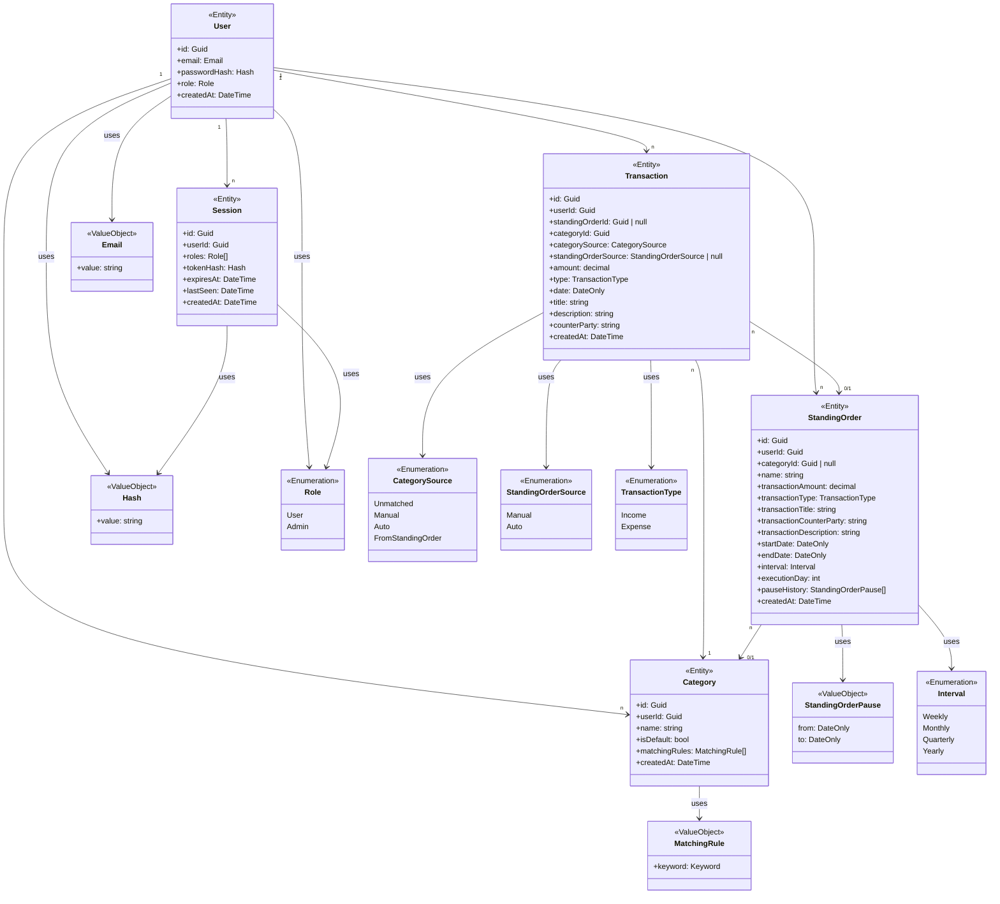

# Domain-Model

```mermaid
classDiagram
    class User {
        <<Entity>>
        +id: Guid
        +email: Email
        +passwordHash: Hash
        +role: Role
        +createdAt: DateTime
    }

    class Session {
        <<Entity>>
        +id: Guid
        +userId: Guid
        +roles: Role[]
        +tokenHash: Hash
        +expiresAt: DateTime
        +lastSeen: DateTime
        +createdAt: DateTime
    }

    class Transaction {
        <<Entity>>
        +id: Guid
        +userId: Guid
        +standingOrderId: Guid | null
        +categoryId: Guid
        +categorySource: CategorySource
        +standingOrderSource: StandingOrderSource | null
        +amount: decimal
        +type: TransactionType
        +date: DateOnly
        +title: string
        +description: string
        +counterParty: string
        +createdAt: DateTime
    }

    class Category {
        <<Entity>>
        +id: Guid
        +userId: Guid
        +name: string
        +isDefault: bool
        +matchingRules: MatchingRule[]
        +createdAt: DateTime
    }

    class StandingOrder {
	    <<Entity>>
	    +id: Guid
	    +userId: Guid
	    +categoryId: Guid | null
	    +name: string
        +transactionAmount: decimal
        +transactionType: TransactionType
        +transactionTitle: string
        +transactionCounterParty: string
        +transactionDescription: string
	    +startDate: DateOnly
	    +endDate: DateOnly
        +interval: Interval
        +executionDay: int
	    +pauseHistory: StandingOrderPause[]
	    +createdAt: DateTime
    }


    class Email {
        <<ValueObject>>
        +value: string
    }

    class Hash {
        <<ValueObject>>
        +value: string
    }

	class MatchingRule {
		<<ValueObject>>
		+keyword: Keyword
	}

    class StandingOrderPause {
		<<ValueObject>>
		from: DateOnly
		to: DateOnly
	}


    class Role {
        <<Enumeration>>
        User
        Admin
    }

	class CategorySource {
		<<Enumeration>>
		Unmatched
		Manual
		Auto
		FromStandingOrder
	}
	
    class StandingOrderSource {
        <<Enumeration>>
        Manual
        Auto
    }
    
    class TransactionType {
	    <<Enumeration>>
	    Income
	    Expense
    }

    class Interval {
        <<Enumeration>>
        Weekly
        Monthly
        Quarterly
        Yearly
    }


	User --> Email : uses
    User --> Hash : uses
    User --> Role : uses

    User "1" --> "n" Session
	User "1" --> "n" Category
	User "1" --> "n" Transaction
	User "1" --> "n" StandingOrder

    Transaction "n" --> "0/1" StandingOrder
    Transaction "n" --> "1" Category
    StandingOrder "n" --> "0/1" Category

    Session --> Hash : uses
    Session --> Role : uses

	Category --> MatchingRule : uses
	StandingOrder --> Interval : uses
    StandingOrder --> StandingOrderPause : uses

    Transaction --> CategorySource : uses
    Transaction --> StandingOrderSource : uses
    Transaction --> TransactionType : uses

```