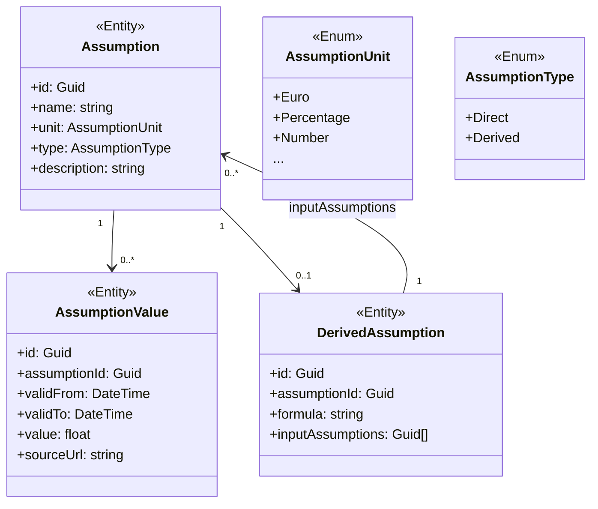

Verwaltung von Planungsannahmen, Werte mit denen man in die Zukunft plant, z.B. Strompreis, Inflationsrate, Stromverbrauchswachstum.

Annahmen haben:
- einen Wert, der je nach Zeitraum unterschiedlich sein kann (2026 anders als 2030)
- eine Quelle
- manche Annahmen sind direkte Eingaben, andere leiten sich ab (durch eine Formel(?)).

---

**1. Als neue Features**
1. Neue Entities: Annahme, Annahmenwert
2. Werden für Analytics, also z.B. die Prognose, verwendet. Dadurch nimmt die Prognose Rücksicht auf Annahmen wie z.B. die Inflationsrate.
3. Geschätze Entwicklung von Ausgaben wie die Miete, welche von mehreren Annahmen abhängen.

**2. Kompletter Umbau**
1. Annahmen sind der Kern der Anwendung. Verwaltung von Annahmen und Annahmewerten ist die zentrale Aufgabe der Anwendung.
2. Entities: Annahme, Annahmewert

## Datenmodell

**Mögliche Probleme zum beachten**
- Circular dependencies zwischen `Assumption` -> `DerivedAssumption` - > `Assumption`

## Datenbankdesign

### `assumptions`
| Column | Type | Nullable | Default | Constraints |
|---|---|---|---|---|
| `id` | `uuid` | NOT NULL |   | PK |
| `name` | `varchar(255)` | NOT NULL |   |   |
| `unit` | `varchar(50)` | NOT NULL |   | CHECK (unit IN ..) |
| `type` | `varchar(20)` | NOT NULL |   | CHECK (type IN ('Direct', 'Derived')) |
| `description` | `text` | NULL |   |   |

**Indexes**
| Name | Type | Columns | Eigenschaften |
|---|---|---|---|
| `PK_assumptions` | PK | `id` |   |
| `ix_assumptions_name` | UNIQUE | `name` | btree, ASC |

---

### `assumption_values`
| Column | Type | Nullable | Default | Constraints |
|---|---|---|---|---|
| `id` | `uuid` | NOT NULL |   | PK |
| `assumption_id` | `uuid` | NOT NULL |   | FK (assumptions) |
| `valid_from` | `date` | NOT NULL |   |   |
| `valid_to` | `date` | NOT NULL |   | CHECK (valid_to >= valid_from) |
| `value` | `float` | NOT NULL |   |   |
| `source_url` | `varchar(500)` | NULL |   |   |

**Indexes**
| Name | Type | Columns | Eigenschaften |
|---|---|---|---|
| `PK_assumption_values` | PK | `id` |   |
| `ix_assumption_values_assumption_id` | INDEX | `assumption_id` | btree, ASC |

---

### `derived_assumptions`
| Column | Type | Nullable | Default | Constraints |
|---|---|---|---|---|
| `id` | `uuid` | NOT NULL |   | PK |
| `assumption_id` | `uuid` | NOT NULL |   | FK (assumptions) |
| `formula` | `text` | NOT NULL |   |   |
| `input_assumptions` | `uuid[]` | NOT NULL |   | CHECK (array_length(input_assumptions, 1) > 0) |

**Indexes**
| Name | Type | Columns | Eigenschaften |
|---|---|---|---|
| `PK_derived_assumptions` | PK | `id` |   |
| `ix_derived_assumptions_assumption_id` | INDEX | `assumption_id` | btree, ASC |

