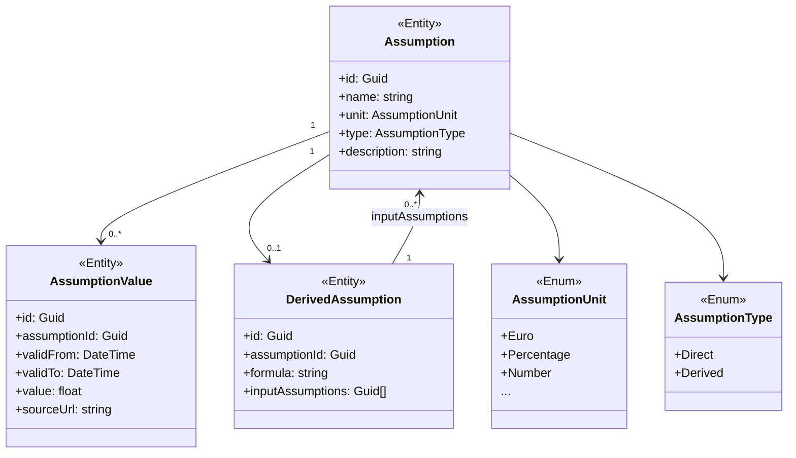

Verwaltung von Planungsannahmen, Werte mit denen man in die Zukunft plant, z.B. Strompreis, Inflationsrate, Stromverbrauchswachstum.

Annahmen haben:
- einen Wert, der je nach Zeitraum unterschiedlich sein kann (2026 anders als 2030)
- eine Quelle
- manche Annahmen sind direkte Eingaben, andere leiten sich ab (durch eine Formel(?)).

---

**Veränderungen**

Aktuell beziehen sich die Beträge von Transaktionen auf die Gegenwart bzw. Vergangenheit.
Alles was in die Zukunft geht, ist mit einer Annahme verknüpfbar.
(z.B. Standing Orders, Analytics-Prognose)

1. Bleibt: Categories, Transactions, StandingOrders, ..
    Aber mit der Möglichkeit, dass die Beträge von Annahmen abhängen, gerade auch bei Analytics-Prognosen & StandingOrders.
1. Neue Entities: Annahme, Annahmenwert, Annahmeformel(?)
2. Könnten für Analytics, also z.B. die Prognose, verwendet werden. Dadurch nimmt die Prognose Rücksicht auf Annahmen wie z.B. die Inflationsrate.
3. Auch gut für die geschätze Entwicklung von Ausgaben wie die Miete, welche von mehreren Annahmen abhängen könnten (z.B: Strompreis, Mietpreisentwicklung, Inflation, etc.)
4. So kann z.B. `StandingOrder.TransactionAmount` durch eine Annahme ersetzt werden. Dadurch kann der Betrag der Transaktion in der Zukunft variieren, z.B. durch Mietpreisentwicklung.


## Datenmodell



**Mögliche Probleme zum beachten / offene Fragen**
> Circular dependencies zwischen `Assumption` -> `DerivedAssumption` - > `Assumption`?

> Lücken in den Zeiträumen der `AssumptionValue`'s & Überlappungen?

>Formel Auswertung?

## Datenbankdesign

### `assumptions`
| Column | Type | Nullable | Default | Constraints |
|---|---|---|---|---|
| `id` | `uuid` | NOT NULL |   | PK |
| `name` | `varchar(255)` | NOT NULL |   |   |
| `unit` | `varchar(50)` | NOT NULL |   | CHECK (unit IN ..) |
| `type` | `varchar(20)` | NOT NULL |   | CHECK (type IN ('Direct', 'Derived')) |
| `description` | `text` | NULL |   |   |

**Indexes**
| Name | Type | Columns | Eigenschaften |
|---|---|---|---|
| `PK_assumptions` | PK | `id` |   |
| `ix_assumptions_name` | UNIQUE | `name` | btree, ASC |

---

### `assumption_values`
| Column | Type | Nullable | Default | Constraints |
|---|---|---|---|---|
| `id` | `uuid` | NOT NULL |   | PK |
| `assumption_id` | `uuid` | NOT NULL |   | FK (assumptions) |
| `valid_from` | `date` | NOT NULL |   |   |
| `valid_to` | `date` | NOT NULL |   | CHECK (valid_to >= valid_from) |
| `value` | `float` | NOT NULL |   |   |
| `source_url` | `varchar(500)` | NULL |   |   |

**Indexes**
| Name | Type | Columns | Eigenschaften |
|---|---|---|---|
| `PK_assumption_values` | PK | `id` |   |
| `ix_assumption_values_assumption_id` | INDEX | `assumption_id` | btree, ASC |

---

### `derived_assumptions`
| Column | Type | Nullable | Default | Constraints |
|---|---|---|---|---|
| `id` | `uuid` | NOT NULL |   | PK |
| `assumption_id` | `uuid` | NOT NULL |   | FK (assumptions) |
| `formula` | `text` | NOT NULL |   |   |
| `input_assumptions` | `uuid[]` | NOT NULL |   | CHECK (array_length(input_assumptions, 1) > 0) |

**Indexes**
| Name | Type | Columns | Eigenschaften |
|---|---|---|---|
| `PK_derived_assumptions` | PK | `id` |   |
| `ix_derived_assumptions_assumption_id` | INDEX | `assumption_id` | btree, ASC |


## Umsetzung

**Zirkuläre Abhängigkeiten Verhindern**

(alles VOR dem Speichern der Annahme prüfen)
1. Graph erstellen:
    - Knoten = Annahme
    - Kante = "input von" (wenn Annahme A von Annahme B abhängt, dann Kante von A nach B)
2. Prüfen, ob der Graph zyklisch ist:
```python
# (pseudo code)
# node.state = 0 for all nodes (unvisited)
# state = 1: visiting
# state = 2: done
def isCyclic(node, graph):
    if (node.state = 1)
        return true
    else if (node.state = 2)
        return false

    node.state = 1

    for (neighbor in graph.getNeighbors(node))
        if (isCyclic(neighbor, graph))
            return true

    node.state = 2
    return false
```

---

**Formel Auswertung**

Nicht über Eval (zu unsicher, Angreifer könnten Code injizieren), sondern über einen eigenen Formel-Interpreter.

Wir gehen davon aus dass keine zirkulären Abhängigkeiten zwischen Annahmen bestehen.

1. Parsen: 
    - Tokenisierung: Zerlegung der Formel in Tokens
        - Floats
        - Referencen (z.B. als index in der Liste der InputAssumptions `$0 * $1`)
        - Arithmetische Operatoren: +, -, *, /
        - Klammern: (, )
    - Syntaxanalyse: Aufbau eines abstrakten Syntaxbaums (AST) aus den Tokens
2. Auswertung:
    - Traversierung des AST und Berechnung des Ergebnisses basierend auf den Werten
    - (falls nötig) Rekursive Auswertung von InputAssumptions, um deren Werte zu erhalten (wichtig dass der Graph hier nicht zyklisch ist, sonst Endlosschleife)

> Soll Zulässig sein dass ungültige Formeln gespeichert werden, oder soll das beim Speichern geprüft werden?


---

**Lücken in den Zeiträumen der `AssumptionValue`'s & Überlappungen**

Für **Überlappungen**:
Bei überlappende Zeiträume ist es unklar, welcher Wert für den Zeitraum gilt.
Deswegen: nicht erlauben, beim Erstellen/Ändern von Annahmen muss der Benutzer sicherstellen, dass die Zeiträume nicht überlappen, sonst Fehler.

Ansätze für **Lücken**:
1. Lücken zulassen, dann wird der Wert der Annahme für den Zeitraum als "unbekannt" behandelt. Das gewünschte Verhalten muss der Benutzter spezifieren können (z.B. "letzte bekannte Annahme verwenden", "Fehler werfen", "Durchschnitt berechnen" etc.)
2. Lücken nicht zulassen, dann muss der Benutzer beim Erstellen/Ändern von Annahmen sicherstellen, dass die Zeiträume lückenlos sind.
